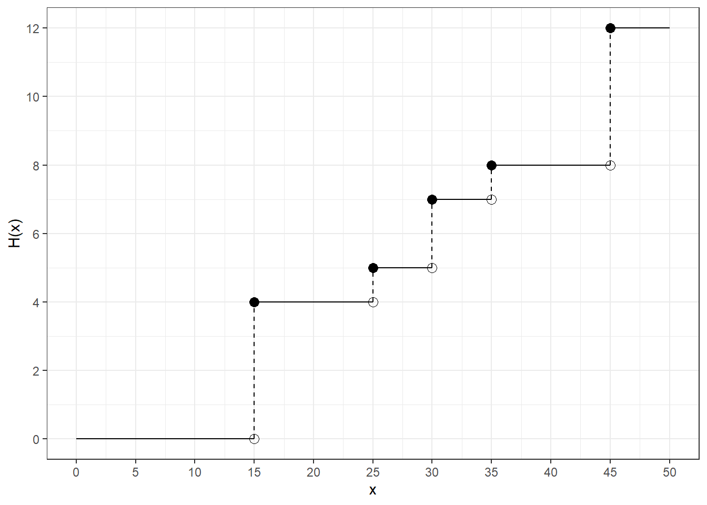
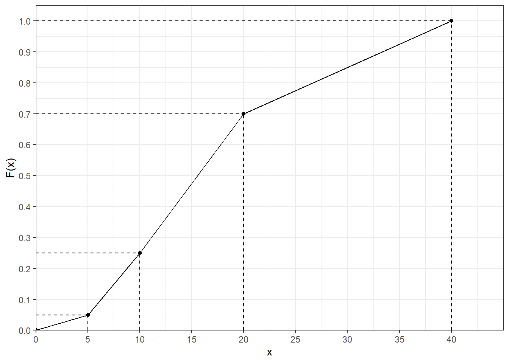
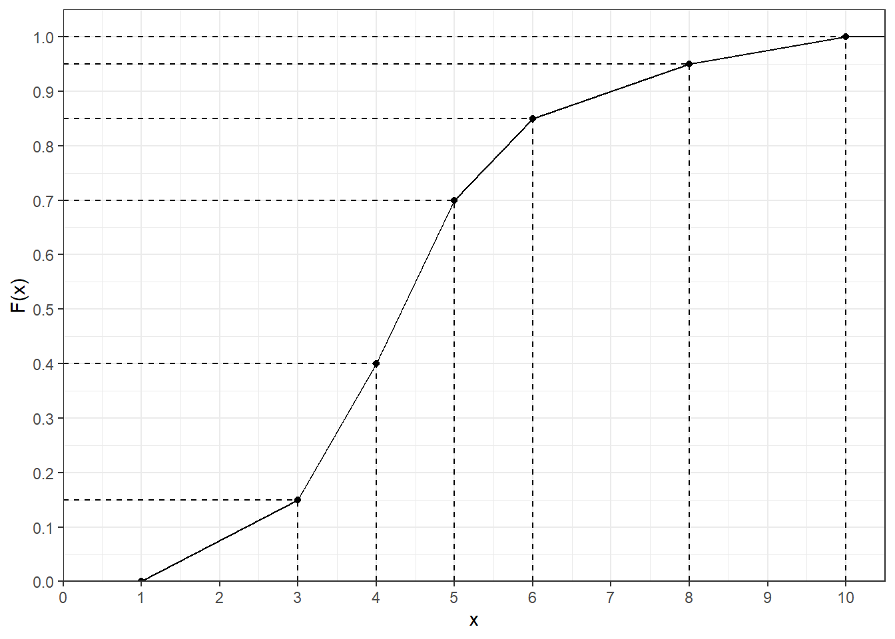
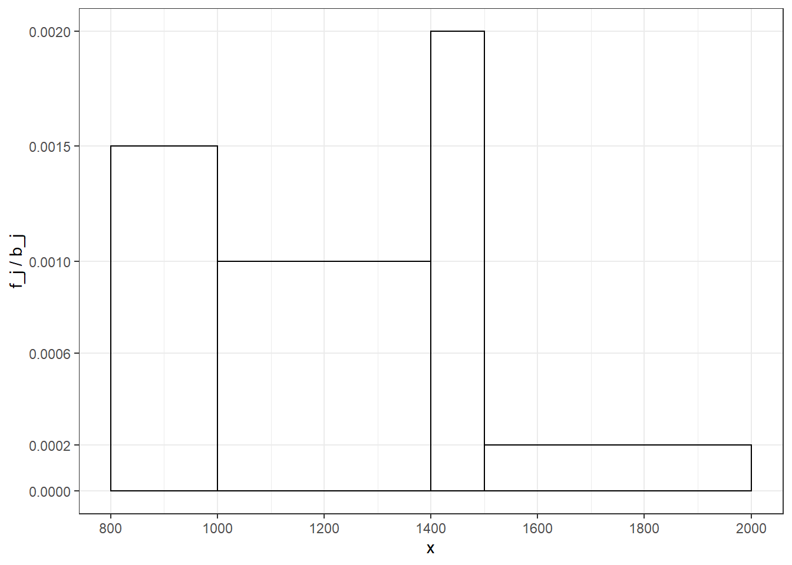
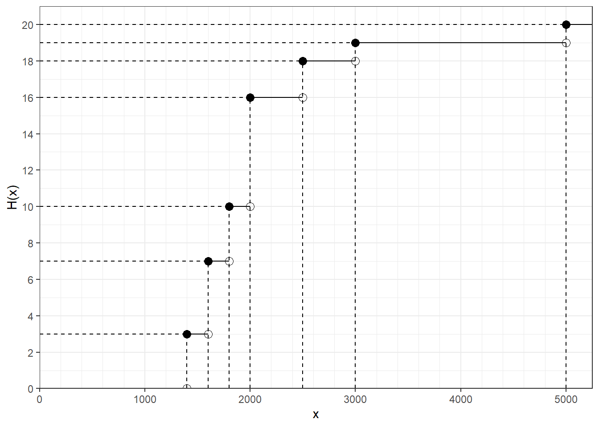

# Empirical Parameters


## Prerequisites {-}


```r
library(ggplot2)
library(dplyr)
library(knitr)

# Set ggplot2 theme
theme_set(theme_bw())
```

## Model Exercise B0 - Geometric mean

Statistix would like to invest its savings of 1,000 EUR in a project. This project has a duration of five years and has the following annual interest rates:

|Time t [years] |Interest rate i | Year-end value [EUR]|
|:--------------|:---------------|--------------------:|
|t_0 = 0        |-               |              1000.00|
|t_1 = 1        |10%             |              1100.00|
|t_2 = 2        |12%             |              1232.00|
|t_3 = 3        |35%             |              1663.20|
|t_4 = 4        |27%             |              2112.26|
|t_5 = 5        |4%              |              2196.75|

### Show that the interest rate i_2 for time t_2 is exactly 12%.

### Calculate the average interest rate per year based on the arithmetic mean.

### Check your result by calculating the average interest rate over 5 years on the starting capital.

### Now calculate the correct average annual interest rate.

### Check your result.

## Exercise B1

Mister Maier owns a garden gnome wholesale with three stores in Berlin, New York and Flensburg. At the end of the business year, he wants an overview of the business situation and therefore requests information in all three stores about the orders received within the last year.

### Part A

His Berlin store is providing the following data:


|Order value in 1000 EUR from ... to less than ... | Number of orders|
|:-------------------------------------------------|----------------:|
|0 - 20                                            |               15|
|20 - 50                                           |               30|
|50 - 150                                          |               45|
|150 - 300                                         |               10|


```r
# Prerequisites
break_left <- c(0, 20, 50, 150)
break_right <- c(20, 50, 150, 300)
n_orders <- c(15, 30, 45, 10)
n_berlin <- sum(n_orders)

tbl <- tibble(break_left = break_left, break_right = break_right, n_orders = n_orders)

kable(tbl)
```


| break_left| break_right| n_orders|
|----------:|-----------:|--------:|
|          0|          20|       15|
|         20|          50|       30|
|         50|         150|       45|
|        150|         300|       10|

#### Determine relative cumulative frequencies.


```r
tbl <- tbl %>%
  mutate(rel_frequency = n_orders / 100) %>%
  mutate(cum_rel_frequency = cumsum(rel_frequency)) %>%
  print()
```

```
## # A tibble: 4 x 5
##   break_left break_right n_orders rel_frequency cum_rel_frequency
##        <dbl>       <dbl>    <dbl>         <dbl>             <dbl>
## 1          0          20       15          0.15             0.15 
## 2         20          50       30          0.3              0.450
## 3         50         150       45          0.45             0.9  
## 4        150         300       10          0.1              1
```

#### Determine lower and upper quartile and median. Draw a box plot.


```r
# Interpolation
x_25 <- 20 + (0.25 - 0.15) / (0.45 - 0.15) * (50 - 20)
x_50 <- 50 + (0.5 - 0.45) / (0.9 - 0.45) * (150 - 50)
x_75 <- 50 + (0.75 - 0.45) / (0.9 - 0.45) * (150 - 50)
x_25
```

```
## [1] 30
```

```r
x_50
```

```
## [1] 61.11111
```

```r
x_75
```

```
## [1] 116.6667
```

#### Calculate the mean order value.


```r
tbl <- tbl %>%
  mutate(group_mean = (break_left + break_right) / 2) %>%
  print() %>%
  mutate(total_order_value = group_mean * n_orders) %>%
  print() %>%
  summarise(mean_order_value = sum(total_order_value) / sum(n_orders)) %>%
  print()
```

```
## # A tibble: 4 x 6
##   break_left break_right n_orders rel_frequency cum_rel_frequency group_mean
##        <dbl>       <dbl>    <dbl>         <dbl>             <dbl>      <dbl>
## 1          0          20       15          0.15             0.15          10
## 2         20          50       30          0.3              0.450         35
## 3         50         150       45          0.45             0.9          100
## 4        150         300       10          0.1              1            225
## # A tibble: 4 x 7
##   break_left break_right n_orders rel_frequency cum_rel_frequen~ group_mean
##        <dbl>       <dbl>    <dbl>         <dbl>            <dbl>      <dbl>
## 1          0          20       15          0.15            0.15          10
## 2         20          50       30          0.3             0.450         35
## 3         50         150       45          0.45            0.9          100
## 4        150         300       10          0.1             1            225
## # ... with 1 more variable: total_order_value <dbl>
## # A tibble: 1 x 1
##   mean_order_value
##              <dbl>
## 1             79.5
```

```r
x_bar_berlin <- tbl$mean_order_value
```

#### What is your assumptions for this calculation?

Uniform distribution within a group.

#### What is the biggest possible difference between the mean of the original data and the mean of the grouped data

Half the group width, that means 75.000 EUR.

### Part B

The story in New York answers the request as follows:

$$95 \, \mathrm{orders} \, | \, \bar{x} = 60.000\$ \, | \, s^2 = 16.000.000\$^2$$

To improve comparability, Mister Maier wants to get his information in EUR.

#### Prerequisites {-}


```r
n_new_york <- 95
```

#### Calculate the corresponding values for an exchange rate of 1$ = 1.5 EUR.


```r
x_bar_dollar <- 60000
x_bar_new_york <- 60000 * 1.5

var_dollar <- 16e6
# 1st variant
sd_dollar <- sqrt(var_dollar)
sd_euro <- sd_dollar * 1.5
var_new_york <- sd_euro^2
# 2nd variant
var_new_york_2 <- var_dollar * 1.5^2

x_bar_new_york
```

```
## [1] 90000
```

```r
var_new_york
```

```
## [1] 3.6e+07
```

```r
var_new_york_2
```

```
## [1] 3.6e+07
```

### Part C

From Flensburg Mister Maier gets the following data:

```r
x_flensburg <- c(2e3, 12e3, 17e3, 12e3, 200e3)
n_flensburg <- length(x_flensburg)
```

#### Calculation of which means is meaningful in this case?


```r
# Arithmetic mean
mean(x_flensburg)
```

```
## [1] 48600
```

```r
# Geometric mean
prod(x_flensburg)^(1 / length(x_flensburg))
```

```
## [1] 15782.44
```

A telex corrects the value for the last order to 2 000 instead of 200 000.

#### Based on the corrected data calculate arithmetic mean and standard deviation of order values.


```r
x_flensburg[length(x_flensburg)] <- 2000

x_bar_flensburg <- mean(x_flensburg)
x_bar_flensburg
```

```
## [1] 9000
```

```r
# IMPORTANT: Don't use sd as it computes the sample 
# standard deviation instead of the empirical 
# standard deviation
sd_flensburg <- sqrt(1 / n_flensburg * sum((x_flensburg - x_bar_flensburg)^2))
var_flensburg <- sd_flensburg^2
```

#### Compare the deviation of order value between the New York and the Flensburg store using an appropriate measure.


```r
# New York (compare Part B)
var_new_york
```

```
## [1] 3.6e+07
```

```r
# Flensburg
var_flensburg
```

```
## [1] 3.6e+07
```

```r
# New York and Flensburg stores share the same standard deviation 
# and variance.
```

#### Calculate the mean order value for the whole business


```r
# Berlin (compare Part A)
total_order_value_berlin <- 100 * 79.5e3

# New York (compare Part B)
total_order_value_new_york <- 95 * 90e3

# Flensburg
total_order_value_flensburg <- sum(x_flensburg)

mean_order_value <- (
  total_order_value_berlin + total_order_value_new_york + total_order_value_flensburg
) / (100 + 95 + 5)
mean_order_value
```

```
## [1] 82725
```

#### Calculate the empirical variance of order value for the whole business.


```r
# Berlin variance
n_orders <- c(15, 30, 45, 10)
x_bar_berlin_groups <- c(10e3, 35e3, 100e3, 225e3)
var_berlin <- 1 / n_berlin * sum(n_orders * (x_bar_berlin_groups - x_bar_berlin)^2)
var_berlin
```

```
## [1] 9932365820
```

```r
# Values from previous tasks
n_cities <- c(n_berlin, n_new_york, n_flensburg)
x_bar_cities <- c(x_bar_berlin, x_bar_new_york, x_bar_flensburg)
var_cities <- c(var_berlin, var_new_york, var_flensburg)

# Total variance
var_all <- 1 / sum(n_cities) * (
  sum(n_cities * var_cities) + sum(n_cities * (x_bar_cities - mean(x_bar_cities))^2)
)
```

#### Which percentage of total variance is generated by considering each store separately?


```r
1 / sum(n_cities) * sum(n_cities * (x_bar_cities - mean(x_bar_cities))^2) / var_all
```

```
## [1] 0.2963381
```

## Exercise B2

Every week, the production manager of a company that manufactures tools has to work out a machine allocation plan. For this purpose he needs all orders with the respective quantities [in thousands of pieces]. The computer of the company provides him with the data of this week in the following graphic representation:



### What is the statistical feature? How is it scaled?

### Determine absolute and relative frequencies.

### Determine (without calculating) the value of the arithmetic mean and the median. Justify your answer briefly.

### Determine the empirical variance.

### Group order quantities in the following groups: 0 - 20 | 20 - 40 | 40 - 60

### Determine the value of the arithmetic mean and the empirical variance from the grouped data.

### Explain possible differences of the parameter values between original and grouped data

The production manager wants to distribute the production of the ordered tools to the three machines A, B and C.

* Machine A is to produce exactly 40% of this week's order volume.
* For technical reasons, the quantity produced by machine B depends on the production quantity of machine A and is only 25% of the quantity produced by machine A.
* The rest of the order volume is to be produced by machine C.

### How many tools are produced by machine A?

### What percentage of the total order volume is produced by machine B?

### How many tools are produced by machine C?

## Exercise B3

As part of a medical examination, 200 people were asked how many cups of coffee they drink per week. The result of this examination is shown in the following graph:



### What do you call this graphic representation? What was assumed about the distribution of the data?

### Draw the absolute frequency distribution. Which principle should be observed?

### Determine the arithmetic mean and median from the data.

### Interpret both values in terms of how the data is distributed.

### Indicate the percentage of people who drink at least 20 cups of coffee per week.

Let's assume that when you look through the data again, you find that the frequencies of the 3rd group and the 4th group have been swapped.

### Does this change the value of the median?

## Exercise B4

An arithmetic mean of $\bar{x} = 2813$ was determined from $n = 78$ observations. In addition to these observations, an observation of 2100 was added.

### What is the arithmetic mean now?


```r
(1 / 79) * (78 * 2813 + 2100)
```

```
## [1] 2803.975
```

## Exercise B5

Bert is a computer freak. In order to avoid losing touch with the computer world, he likes to be kept up to date with all the latest developments. For this purpose he connected his computer (all day long) to a so-called internet server, for which he has to pay hefty telephone charges. Due to a tariff change of the telephone company, Bert now fears that he can no longer afford this luxury, which is exactly the case when he has to pay more than 6 EUR per hour on average for the telephone connection.


|Tariff           |Time from ... up to less than ... | Talk time in seconds per cost unit of 8 Cent|
|:----------------|:---------------------------------|--------------------------------------------:|
|Night Tariff     |01:00 - 06:00                     |                                          120|
|Morning Tariff   |06:00 - 12:00                     |                                           40|
|Afternoon Tariff |12:00 - 19:00                     |                                           30|
|Evening Tariff   |19:00 - 01:00                     |                                           60|

### Calculate for the new tariff how much the telephone connection costs on average in EUR per hour. So can Bert still afford his hobby in the future?

## Exercise B6

The following empirical distribution function $F(x)$ was obtained for the monthly gross income [in 1000 EUR] of the 2000 employees of a company:



### What is the name of the statistical feature examined here and how is it scaled?

### Determine the absolute and the relative frequency distribution of this characteristic

### Visualize the absolute frequency distribution.

### According to your visualization, how big is the percentage of employees who earn exactly 6400 EUR per month?

### Calculate how many percent of the employees earn more than 5800 EUR per month.

### What is the (estimated) monthly gross income of all employees of this company?

### What is the average monthly gross income in this company

#### by the arithmetic mean?

#### by the median?

### Calculate the empirical quartile coefficient of skewness.

### Assess the skewness of the present frequency distribution

#### according to the position rule.

#### according to the empirical quartile coefficient of skewness.

## Exercise B7

Multiple Choice Questions

1. One speaks of the _principle of equal area_ when, in the graphic representation of absolute frequencies of grouped data, the flatness of a block is proportional to the absolute frequency to be represented.

  + True.

2. The frequency distributions of two cardinally scaled features do not have to be identical even if the two features have the same arithmetic mean and the same variance.

  + True.

3. Statistical quantities can be classified with respect to their value range.

  + True.

4. The empirical distribution function is not only defined for values that were also observed.

  + False? Empirical means observed. One could argue that she could use aggregated values instead of bare observations.

5. The empirical quartile distance of an ordered data set is a measure of variability which is outlier-sensitive.

  + False.  

6. The step heights of an empirical (relative) distribution function correspond to the relative cumulative frequencies.

  + False, they correspond to the relative frequencies.

7. The coefficient of variation is a dimensionless measure.

  + True.

8. If: $h(a_j) = n$ , then the underlying statistical characteristic has only one possibility of realization. 

  + False. Other possible realizations were just not observed, but may surely exist.

9. A train travels $97 \, \mathrm{km}$ at a speed of $64 \frac{\mathrm{km}}{\mathrm{h}}$ and another $97 \, \mathrm{km}$ at a speed of $192 \frac{\mathrm{km}}{\mathrm{h}}$ . Then the average speed for the total distance is 96km/h.

  + True. $\frac{97 \, \mathrm{km} + 97 \, \mathrm{km}}{\frac{1}{64} \frac{\mathrm{h}}{\mathrm{km}} \cdot 97 \, \mathrm{km} + \frac{1}{192} \frac{\mathrm{h}}{\mathrm{km}} \cdot 97 \, \mathrm{km}} = 96 \frac{\mathrm{km}}{\mathrm{h}}$.

10. A statistical characteristic is called continuous if its range of values is countably infinite.

  + False. Its range must be uncountably infinite.

## Exercise B8

The gross monthly wage of the head of household was determined for 20 households. The following values [in EUR] resulted:


```r
x <- c(2400, 3300, 2400, 2300, 2500, 1700, 2100, 3100, 2900, 1800, 3900, 2100, 2900, 1500, 2700, 2200, 2000, 2500, 2600, 2200)
```

### Determine the average monthly gross earnings.

### Calculate the empirical variance and standard deviation of the 20 gross wages.

### Determine the variation coefficient. What is this coefficient for?

## Exercise B9

In Metropolis, 4000 residents with $50 \, \mathrm{m}^2$ living space were asked about their rent levels. In order to get a better overview, the rent amounts were divided into classes.

The following histogram resulted:



### Calculate the values of the empirical distribution function at the locations:

#### x = 1000

#### x = 1350

#### x = 1950

### Draw the empirical distribution function.

### Calculate the arithmetic mean.

### Calculate:

#### 0.25-Quantile

#### Median

#### 0.75 Quantile

#### Draw a box plot.

### Calculate the empirical quartile coefficient of skewness g_0.25.

### Which statement regarding the skewness of the present distribution can be derived from

#### the calculated skew coefficient g_0.25

#### the position rule (comparison of median and arithmetic mean) 

### Give a short explanation for the different results you have received in the previous task.

## Exercise B10

Tony is editor-in-chief of the automotive magazine _Brummy!_. In the anniversary edition he would like to present to his readers a statistical analysis of the cubic capacity [in cm3] of the cars tested so far.
For this purpose he had the following absolute distribution function prepared by his trainee:



### Part A

#### What is the statistical characteristic and how is it scaled?

#### Determine the absolute frequencies from the distribution function in tabular form.

#### Calculate the arithmetic mean and the empirical standard deviation.

#### Transform the parameter values calculated in 3) into liters. The following applies: 1 liter = 1dm^3

### Part B

Tony wants to divide the data into three groups:

* Middle Class: $\text{from} \, 1400 \, \mathrm{cm}^3 \, \text{to under} \, 2000 \, \mathrm{cm}^3$
* Middle Class: $\text{from} \, 2000 \, \mathrm{cm}^3 \, \text{to under} \, 3000 \, \mathrm{cm}^3$
* Middle Class: $\text{from} \, 3000 \, \mathrm{cm}^3 \, \text{to under} \, 6000 \, \mathrm{cm}^3$

#### Determine the absolute and relative frequencies of the grouped data in tabular form.

#### Calculate the arithmetic mean of the grouped data.

#### Display the absolute frequency distribution of the grouped data.

#### Determine the absolute cumulative and relative cumulative frequencies of the grouped data in a table and display the relative distribution function graphically. What assumptions are made about the distribution of data within the individual groups?

#### Calculate the lower and upper quartiles and the median from the grouped data.

#### Create a modified box plot for the grouped data.
