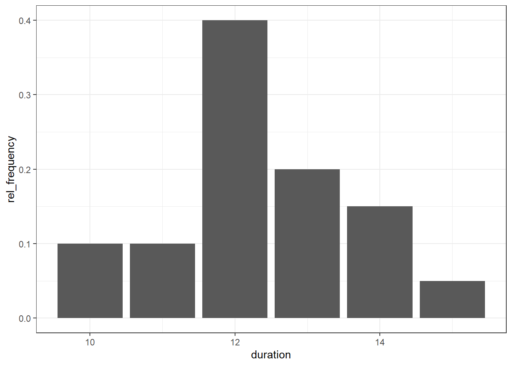
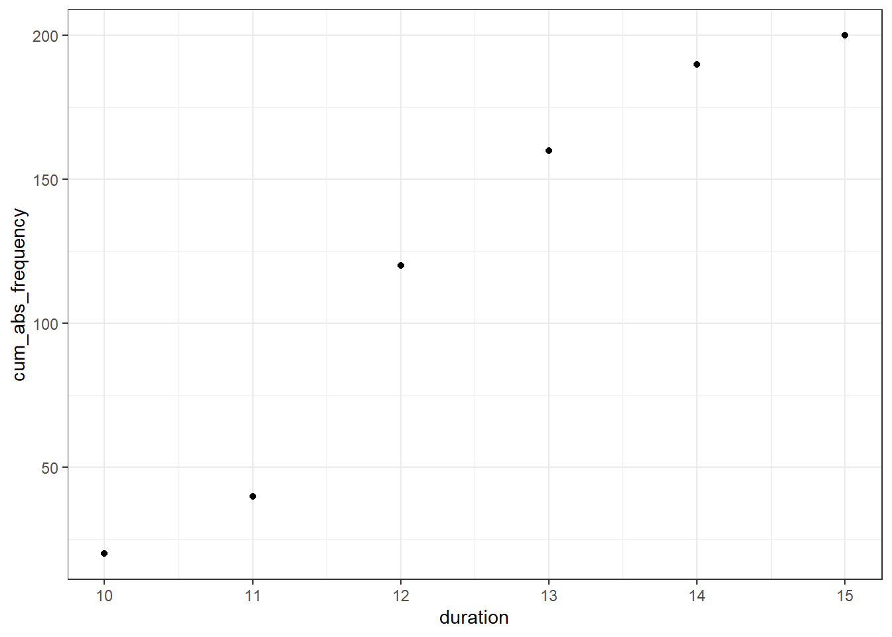
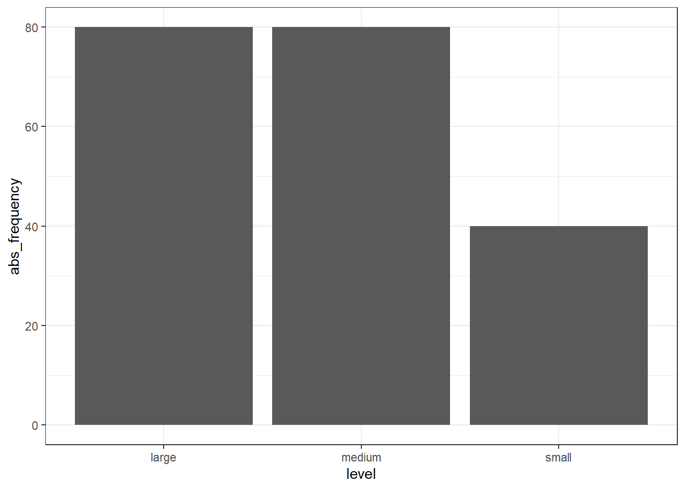
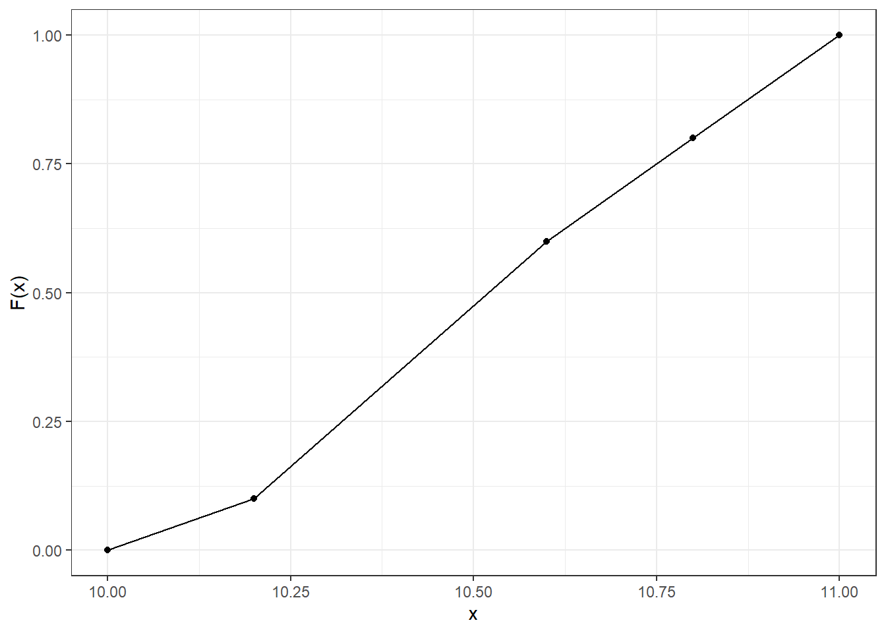
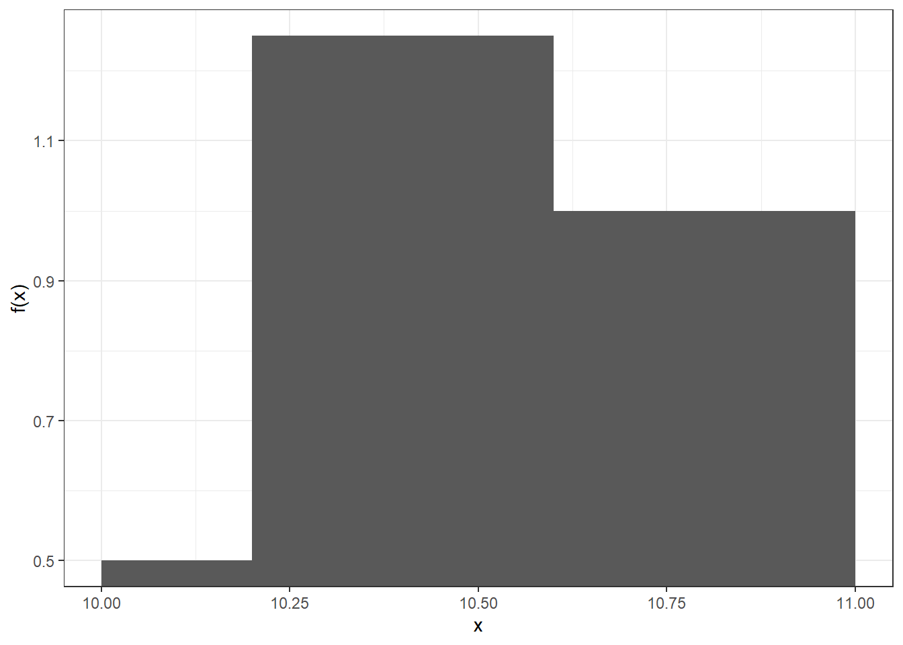
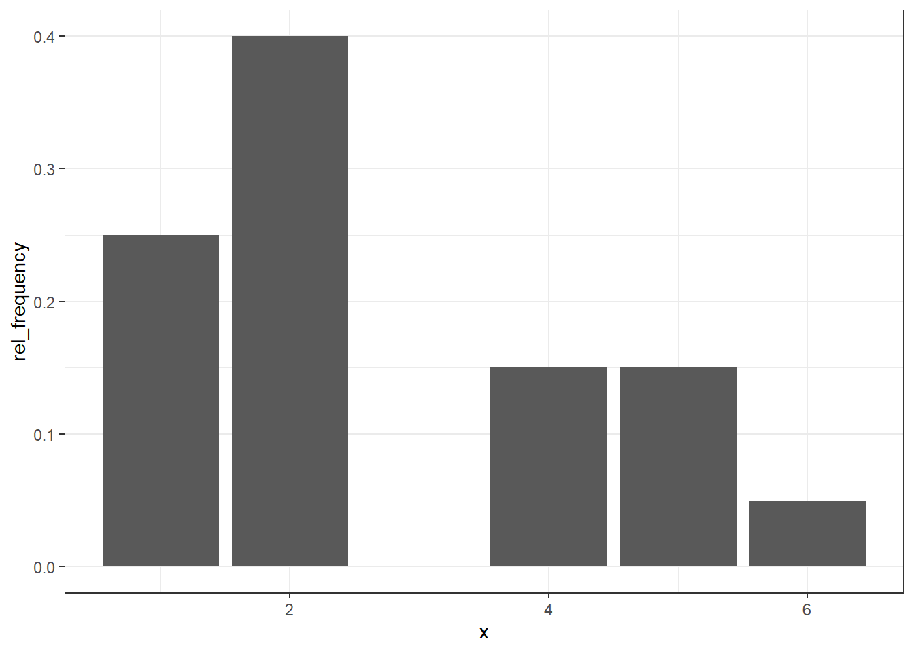
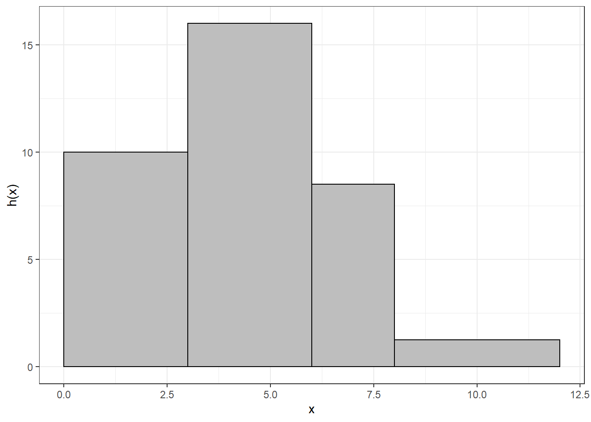
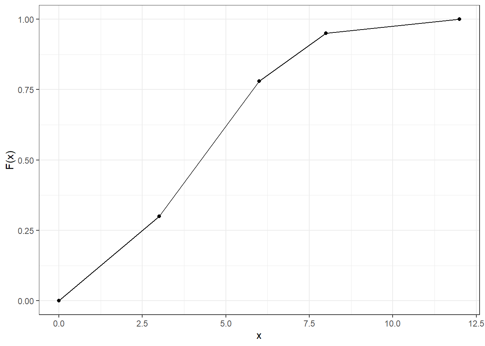

# (APPENDIX) Appendix {-}

# Frequencies


## Prerequisites {-}


```r
library(ggplot2)
library(dplyr)
library(knitr)

# Set ggplot2 theme
theme_set(theme_bw())
```

## Exercise A1

### Part A

The duration of study of 200 industrial engineers is examined. The following results were obtained:


```r
n <- 200
duration <- c(10, 11, 12, 13, 14, 15)
rel_frequency <- c(0.1, 0.1, 0.4, 0.2, 0.15, 0.05)
tbl <- tibble(duration = duration, rel_frequency = rel_frequency) %>%
  mutate(cum_rel_frequency = cumsum(rel_frequency))

tbl
```

```
## # A tibble: 6 x 3
##   duration rel_frequency cum_rel_frequency
##      <dbl>         <dbl>             <dbl>
## 1       10          0.1               0.1 
## 2       11          0.1               0.2 
## 3       12          0.4               0.6 
## 4       13          0.2               0.8 
## 5       14          0.15              0.95
## 6       15          0.05              1
```

#### What is the statistical feature? How is it scaled?

The feature is the duration study of an industrial engineer. It is interval-scaled.

#### Determine the absolute frequencies.


```r
tbl <- mutate(tbl, abs_frequency = n * rel_frequency)
tbl$abs_frequency
```

```
## [1] 20 20 80 40 30 10
```

#### Determine the cumulative absolute frequencies.


```r
tbl <- mutate(tbl, cum_abs_frequency = cumsum(abs_frequency))
tbl$cum_abs_frequency
```

```
## [1]  20  40 120 160 190 200
```

#### Plot frequencies and cumulative  (relative and absolute).


```r
# Relative frequencies
ggplot(tbl) +
  geom_col(aes(x = duration, y = rel_frequency))
```



```r
# Relative cumulative frequencies
ggplot(tbl) +
  geom_point(aes(x = duration, y = cum_rel_frequency))
```


```r
# Absolute frequencies
ggplot(tbl) +
  geom_col(aes(x = duration, y = abs_frequency))
```


```r
# Absolute cumulative frequencies
ggplot(tbl) +
  geom_point(aes(x = duration, y = cum_abs_frequency))
```



#### What is the maximum duration of study of the 10%-fastest students?

10 semesters.

#### What is the minimum duration of study of the 80%-slowest students?

12 semesters.

#### What is the duration of study for exact 20% of all students?

13 semesters.

### Part B

Now we consider the feature $Y$: _duration of study_ with levels:

* *small* (less than 12 semesters)
* *medium* (12 semesters)
* *large* (more than 12 semesters)

#### How is the feature Y scaled?

It is ordinal-scaled.

#### Plot the absolute frequency function.


```r
# Function that converts duration to level
duration_to_level <- function(x) {
  if (x < 12) "small" else if (x == 12) "medium" else "large"
}
# Vectorize this function in order to work with vector input
duration_to_level <- Vectorize(duration_to_level)

# Prepare dataset
tbl <- select(tbl, duration, rel_frequency, abs_frequency) %>%
  mutate(level = duration_to_level(duration)) %>%
  group_by(level) %>%
  summarise(rel_frequency = sum(rel_frequency), abs_frequency = sum(abs_frequency))
tbl
```

```
## # A tibble: 3 x 3
##   level  rel_frequency abs_frequency
##   <chr>          <dbl>         <dbl>
## 1 large            0.4            80
## 2 medium           0.4            80
## 3 small            0.2            40
```

```r
# Plot
ggplot(tbl) +
  geom_col(aes(x = level, y = abs_frequency))
```



#### Does it make sense to use a cumulative distribution function for a nominal-scaled feature?

No.

## Exercise A2

### 100m race

The 100m times of 20 athletes were measured. They obtained the following cumulative distribution function:



#### Draw the corresponding histogram


```r
break_left <- c(10, 10.2, 10.6, 10.8)
break_right <- c(10.2, 10.6, 10.8, 11)
f <- c(0.1 / 0.2, 0.5 / 0.4, 0.2 / 0.2, 0.2 / 0.2)
tbl <- tibble(break_left = break_left, break_right = break_right, f = f)

ggplot(tbl, aes(xmin = break_left, xmax = break_right, ymax = f)) +
  geom_rect(ymin = 0) +
  labs(x = "x", y = "f(x)")
```



#### Which was the maximum time of the 80%-fastest athletes?

10.8 seconds.

#### What is the assumption about the distribution of measured values within a group when determining the cumulative distribution function?

Uniform distribution within a group.

#### Use the cumulative distribution function to determine which was the maximum time needed by the five fastest athletes.


```r
# Interpolation
t_max <- 10.2 + (0.25 - 0.1) / (0.6 - 0.1) * (10.6 - 10.2)
t_max
```

```
## [1] 10.32
```

## Exercise A3

### Tennis

In a year tennis ace Boris B. participated in 40 tournaments all around the world. Every tournament consisted of six rounds:
* 1st Round
* 2nd Round
* 3rd Round (Round of 16)
* 4th Round (Round of 8)
* 5th Round (Semi-Final)
* 6th Round (Final)

Boris is not satisfied with his overall performance. Even though he reached the final two times and was six times only defeated in the semi-final, he lost ten times in the 1st Round and 16 times in the 2nd Round. He never dropped out in the 3rd Round.

#### What is the statistical feature? How is it scaled?

The feature is the number of the highest round Boris reached in a tournament. It is interval-scaled.

#### Determine absolute and relative frequencies as well as absolute and relative cumulative frequencies.


```r
x <- 1:6
abs_frequency <- c(10, 16, 0, 6, 6, 2)
tbl <- tibble(x = x, abs_frequency = abs_frequency)

tbl <- tbl %>%
  mutate(rel_frequency = abs_frequency / sum(abs_frequency)) %>%
  mutate(cum_abs_frequency = cumsum(abs_frequency)) %>%
  mutate(cum_rel_frequency = cumsum(rel_frequency))
tbl
```

```
## # A tibble: 6 x 5
##       x abs_frequency rel_frequency cum_abs_frequency cum_rel_frequency
##   <int>         <dbl>         <dbl>             <dbl>             <dbl>
## 1     1            10          0.25                10              0.25
## 2     2            16          0.4                 26              0.65
## 3     3             0          0                   26              0.65
## 4     4             6          0.15                32              0.8 
## 5     5             6          0.15                38              0.95
## 6     6             2          0.05                40              1
```

#### Draw the empirical relative distribution function.


```r
ggplot(tbl) +
  geom_col(aes(x = x, y = rel_frequency))
```



#### At what percentage of tournaments Boris dropped out before the 3rd Round?

26 / 40.

#### At what percentage of tournaments Boris reached at least the semi-finals?

8 / 40.

#### At how many tournaments Boris played at least in the 2nd Round?

30.

#### At most which round Boris dropped out in 80% of all tournaments?

4th Round.

#### Which round Boris dropped out in exact 40% of all tournaments?

2nd Round.

#### Give an interpretation of F(x) at x = 7.

$F(7) = 1$, because $F(x) = 1 \, \forall \, x >= 6$. That means it is impossible to ever reach the 7th Round as it does not exist.

## Exercise A4

### Study time

100 students were asked how much time they spend for their studies per day. None of them spent more than 12 hours. 22 students spent more than six hours. 30% of all interviewed students were spending less than three hours, whereas 65% of students invest between three and eight hours per day.

#### What is the statistical feature? How is it scaled?

The feature is the time a student spends for her studies per day in hours. It is ratio-scaled.

#### Determine absolute, relative and cumulative frequencies. Group the data in four groups.


```r
n <- 100
break_left <- c(0, 3, 6, 8)
break_right <- c(3, 6, 8, 12)
# 22 students spent more than six hours -> 5 students spent more than 12 hours,
# 17 student spent between six and height hours
f <- c(0.3, 0.48, 0.17, 0.05)

tbl <- tibble(break_left = break_left, break_right = break_right, rel_frequency = f) %>%
  mutate(abs_frequency = rel_frequency * n) %>%
  mutate(cum_rel_frequency = cumsum(rel_frequency)) %>%
  mutate(cum_abs_frequency = cumsum(abs_frequency))

tbl
```

```
## # A tibble: 4 x 6
##   break_left break_right rel_frequency abs_frequency cum_rel_frequen~
##        <dbl>       <dbl>         <dbl>         <dbl>            <dbl>
## 1          0           3          0.3             30             0.3 
## 2          3           6          0.48            48             0.78
## 3          6           8          0.17            17             0.95
## 4          8          12          0.05             5             1   
## # ... with 1 more variable: cum_abs_frequency <dbl>
```

#### Visualize the absolute frequencies.


```r
ggplot(tbl) +
  geom_rect(
    aes(
      xmin = break_left, 
      xmax = break_right, 
      ymin = 0, 
      ymax = abs_frequency / (break_right - break_left)
    ),
    fill = "gray",
    color = "black"
  ) +
  labs(x = "x", y = "h(x)")
```



#### Why did you choose this kind of visualization?

I choose a histogram as it is a meaningful visualization for ratio-scaled data. Don't forget to divide by the group width. The area of a group is proportionate to its absolute frequency and not its height.

#### Visualize the relative cumulative frequencies.


```r
x <- c(0, tbl$break_right)
cum_rel_frequency <- c(0, tbl$cum_rel_frequency)
tbl <- tibble(x = x, cum_rel_frequency = cum_rel_frequency)

ggplot(tbl, aes(x = x, y = cum_rel_frequency)) +
  geom_line() +
  geom_point() +
  labs(x = "x", y = "F(x)")
```



#### Which assumption was made for your visualization?

The distribution within a group is uniform.

#### Use your visualization to find out how many hours at most spent 50% of all students?


```r
# Interpolation
t_max <- 3 + (0.5 - 0.3) / (0.78 - 0.3) * (6 - 3)
t_max
```

```
## [1] 4.25
```

#### How many students work more than five hours per day for their studies?


```r
# F(5)
F_5 <- 0.3 + (5 - 3) / (6 - 3) * (0.78 - 0.3)
F_5
```

```
## [1] 0.62
```

```r
# Solution
(1 - F_5) * n
```

```
## [1] 38
```

## Exercise A5

### Ice cream

This exercise does not cover anything new and is therefore left as an exercise to the reader.

Ice cream seller Benedict wants to sell fresh ice cream to his customers every day. So that he always has the right quantities in stock, he counts the consumption of ice cream scoops on one day for 200 customers. Here it turns out:

* No customer is ordering two scoops or more than six scoops.
* 20% each wanted one scoop or at least five scoops.
* Less than three scoops were ordered by 45% of all customers.
* Ten times more customers wanted four or six scoops than five scoops.

#### What is the statistical feature? How is it scaled?

#### Determine absolute and cumulative absolute frequencies.

#### Visualize the absolute frequencies.

#### Visualize the relative cumulative frequencies.

#### What percentage of customers ordered five or less scoops?

#### How many scoops were bought from the 80% customers with the most scoops?

#### How many scoops were bought from exact 35% of customers?
 
